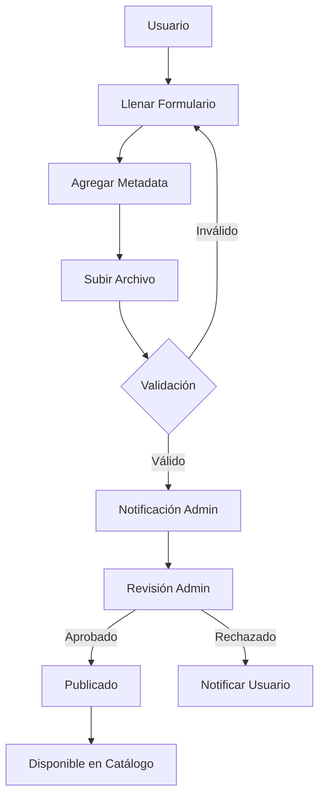
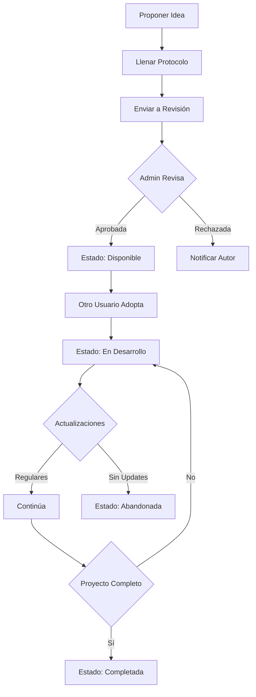

<!-- _class: lead -->
# ISC-Hub
## Plataforma Colaborativa de Recursos Educativos

**Compartiendo Conocimiento ISC**
Instituto Tecnológico de Ciudad Madero

**Jesús Olvera**
© 2025

---

## 📋 Descripción General

Plataforma web colaborativa para compartir recursos educativos entre estudiantes y docentes de Ingeniería en Sistemas Computacionales.

**Misión:**
Facilitar el intercambio de conocimiento mediante una plataforma centralizada donde la comunidad ISC pueda compartir, descubrir y colaborar en recursos educativos y proyectos.

**URL:** [https://jjho05.github.io/ISC-Hub](https://jjho05.github.io/ISC-Hub)

---

## 🎯 Objetivos de la Plataforma

### Principales
- ✅ **Centralizar recursos** educativos de calidad
- ✅ **Facilitar colaboración** entre estudiantes
- ✅ **Promover innovación** mediante el Banco de Ideas
- ✅ **Crear comunidad** activa de aprendizaje

### Secundarios
- ✅ Reducir duplicación de esfuerzos
- ✅ Preservar conocimiento institucional
- ✅ Fomentar cultura de compartir
- ✅ Apoyar desarrollo de proyectos

---

## 🏗️ Arquitectura del Sistema

```
ISC-Hub/
├── Sistema de Recursos
│   ├── index.html              # Landing page
│   ├── subir-recurso.html      # Formulario de carga
│   ├── recursos.html           # Catálogo
│   └── perfil.html             # Perfil de usuario
│
├── Banco de Ideas
│   ├── index.html              # Galería de ideas
│   ├── enviar-idea.html        # Proponer idea
│   ├── mis-ideas.html          # Gestión personal
│   ├── idea-detalle.html       # Vista detallada
│   └── admin/                  # Panel administrativo
│
├── Componentes
│   ├── header.html             # Navegación
│   └── footer.html             # Pie de página
│
└── Assets
    ├── css/                    # Estilos
    ├── js/                     # JavaScript
    └── images/                 # Recursos gráficos
```

---

## 🛠️ Stack Tecnológico

### Frontend
- **HTML5** - Estructura semántica
- **CSS3 Vanilla** - Estilos personalizados
- **JavaScript Vanilla** - Sin frameworks
- **Design System** - Componentes reutilizables

### Backend & Servicios
- **FormSubmit.co** - Notificaciones por correo
- **GitHub Pages** - Hosting gratuito
- **Git** - Control de versiones

### Ventajas del Stack
- ✅ Sin dependencias externas
- ✅ Rendimiento óptimo
- ✅ Fácil mantenimiento
- ✅ 100% compatible con GitHub Pages

---

## 📚 Sistema de Recursos

### Tipos de Recursos

| Tipo | Descripción | Ejemplos |
|------|-------------|----------|
| **Apuntes** | Notas de clase | PDF, DOCX, MD |
| **Códigos** | Programas y scripts | ZIP, GitHub links |
| **Proyectos** | Trabajos completos | Repositorios |
| **Presentaciones** | Slides y demos | PPTX, PDF |
| **Exámenes** | Material de práctica | PDF |
| **Otros** | Recursos diversos | Varios formatos |

---

## 📚 Sistema de Recursos (continuación)

### Características

**Para Usuarios:**
- ✅ Subir recursos con metadata completa
- ✅ Buscar por materia, semestre, tipo
- ✅ Filtros avanzados
- ✅ Vista previa de archivos
- ✅ Sistema de calificaciones
- ✅ Comentarios y feedback

**Para la Comunidad:**
- ✅ Recursos verificados por calidad
- ✅ Estadísticas de descargas
- ✅ Rankings de contribuidores
- ✅ Recursos destacados

---

## 📚 Flujo de Subida de Recursos



---

## 💡 Banco de Ideas

### Concepto

Sistema completo para **proponer, desarrollar y gestionar ideas de proyectos** basados en necesidades reales.

**Inspiración:**
- Proyectos para familiares/conocidos
- Soluciones a problemas cotidianos
- Innovación tecnológica
- Práctica profesional

**Beneficios:**
- ✅ Ideas con impacto real
- ✅ Motivación intrínseca
- ✅ Portfolio profesional
- ✅ Experiencia práctica

---

## 💡 Banco de Ideas - Estados

### Ciclo de Vida de una Idea

| Estado | Icono | Descripción |
|--------|-------|-------------|
| **Pendiente** | 🟡 | En revisión por administrador |
| **Disponible** | 🟢 | Lista para ser adoptada |
| **En Desarrollo** | 🔵 | Siendo trabajada por equipo |
| **Completada** | ✅ | Proyecto finalizado exitosamente |
| **Abandonada** | ⚫ | Sin actualizaciones por tiempo |
| **Rechazada** | 🔴 | No aprobada por admin |

---

## 💡 Protocolo de Ideas

### Información Requerida

**Sección 1: Contexto**
- Antecedentes y justificación
- Problema detectado
- Necesidad real identificada

**Sección 2: Objetivos**
- Objetivo general
- Objetivos específicos (mínimo 3)
- Alcance del proyecto

---

## 💡 Protocolo de Ideas (continuación)

**Sección 3: Planificación**
- Pasos propuestos (metodología)
- Cronograma de actividades
- Recursos necesarios

**Sección 4: Técnica**
- Habilidades/temas necesarios
- Tecnologías sugeridas
- Destino del proyecto (Innovatec, GPS, etc.)

**Sección 5: Equipo**
- Integrantes del equipo
- Profesor asesor (opcional)
- Fecha estimada de inicio

---

## 💡 Flujo del Banco de Ideas



---

## 👥 Panel Administrativo

### Funcionalidades

**Gestión de Ideas:**
- ✅ Dashboard con estadísticas
- ✅ Revisar ideas pendientes
- ✅ Aprobar/rechazar propuestas
- ✅ Cambiar estados manualmente
- ✅ Configurar tiempo de abandono

**Métricas:**
- Total de ideas por estado
- Ideas más populares
- Usuarios más activos
- Proyectos completados
- Tasa de abandono

---

## 👥 Panel Administrativo (continuación)

### Interfaz de Revisión

**Para cada idea pendiente:**
- Ver protocolo completo
- Evaluar viabilidad
- Verificar claridad
- Aprobar con comentarios
- Rechazar con razón

**Acciones Masivas:**
- Marcar abandonadas automáticamente
- Exportar estadísticas
- Generar reportes
- Notificar usuarios

---

## 🎨 Design System

### Paleta de Colores

```css
:root {
  /* Colores Primarios */
  --primary-color: #1B396A;      /* Azul TecNM */
  --primary-dark: #14305C;       /* Azul oscuro */
  
  /* Colores de Estado */
  --success-color: #10b981;      /* Verde */
  --warning-color: #f59e0b;      /* Amarillo */
  --error-color: #ef4444;        /* Rojo */
  --info-color: #3b82f6;         /* Azul info */
  
  /* Neutrales */
  --text-primary: #000000;
  --text-secondary: #807F83;
  --background-color: #ffffff;
  --border-color: #dce0e5;
}
```

---

## 🎨 Componentes Reutilizables

### Header
- Logo ISC-Hub
- Navegación desktop/mobile
- Barra de búsqueda
- Botón "Subir Recurso"
- Avatar de usuario
- Menú desplegable

### Footer
- Información institucional
- Enlaces rápidos
- Categorías
- Contacto
- Redes sociales
- Copyright

---

## 🎨 Componentes Reutilizables (continuación)

### Cards de Recursos
- Thumbnail/icono
- Título y descripción
- Metadata (materia, semestre, tipo)
- Estadísticas (descargas, rating)
- Acciones (descargar, ver, compartir)

### Cards de Ideas
- Estado visual
- Título y resumen
- Tags (Innovatec, GPS, etc.)
- Autor y fecha
- Botón de adopción

---

## 📊 Características Técnicas

### Responsive Design

```css
/* Breakpoints */
@media (max-width: 640px)  { /* Móvil */ }
@media (max-width: 768px)  { /* Tablet */ }
@media (max-width: 1024px) { /* Desktop */ }
@media (max-width: 1280px) { /* Desktop grande */ }
```

### Optimizaciones
- ✅ Mobile-first approach
- ✅ Lazy loading de imágenes
- ✅ Minificación de assets
- ✅ Caching estratégico
- ✅ Compresión de recursos

---

## 📊 Características Técnicas (continuación)

### SEO
```html
<!-- Meta tags optimizados -->
<meta name="description" content="...">
<meta name="keywords" content="...">
<meta property="og:title" content="...">
<meta property="og:description" content="...">
<meta property="og:image" content="...">
<meta property="og:url" content="...">
```

### Accesibilidad
- ✅ Semántica HTML5
- ✅ ARIA labels
- ✅ Contraste de colores WCAG AA
- ✅ Navegación por teclado
- ✅ Screen reader friendly

---

## 🔒 Sistema de Autenticación

### Características (Futuro)

**Registro:**
- Email institucional
- Verificación por correo
- Perfil de usuario

**Login:**
- Email y contraseña
- Recuperación de contraseña
- Sesiones persistentes

**Perfiles:**
- Información personal
- Recursos subidos
- Ideas propuestas
- Estadísticas personales

---

## 📧 Sistema de Notificaciones

### FormSubmit.co Integration

**Eventos que generan notificaciones:**
- ✅ Nuevo recurso subido
- ✅ Nueva idea propuesta
- ✅ Idea aprobada/rechazada
- ✅ Idea adoptada
- ✅ Proyecto completado
- ✅ Comentario en recurso

**Destinatarios:**
- Administradores
- Autores de ideas
- Usuarios que adoptaron ideas

---

## 📈 Métricas y Estadísticas

### Dashboard de Usuario

**Mis Contribuciones:**
- Recursos subidos: 23
- Descargas totales: 156
- Calificación promedio: 4.7/5
- Ideas propuestas: 3
- Ideas adoptadas: 1

**Ranking:**
- Top contribuidor del mes
- Recursos más descargados
- Ideas más populares

---

## 🚀 Instalación y Desarrollo

### Clonar Repositorio
```bash
git clone https://github.com/jjho05/ISC-Hub.git
cd ISC-Hub
```

### Servidor Local
```bash
# Con Python
python3 -m http.server 8000

# Con Node.js
npx http-server

# Abrir en http://localhost:8000
```

### Configurar Notificaciones
Editar `banco-ideas/enviar-idea.html`:
```html
<form action="https://formsubmit.co/TU_EMAIL" method="POST">
```

---

## 🔄 Roadmap y Futuras Mejoras

### Fase 1 (Actual) ✅
- ✅ Sistema de recursos básico
- ✅ Banco de ideas completo
- ✅ Panel administrativo
- ✅ Diseño responsive

### Fase 2 (Próximamente)
- 🔄 Autenticación con Firebase
- 🔄 Base de datos real (Firestore)
- 🔄 Sistema de comentarios
- 🔄 Notificaciones en tiempo real

### Fase 3 (Futuro)
- 📋 Sistema de mensajería
- 📋 Foros de discusión
- 📋 Integración con GitHub
- 📋 API REST pública

---

## 🤝 Contribuciones

### Guías de Estilo

**Código:**
- Seguir convenciones de nomenclatura
- Comentar código complejo
- Mantener consistencia visual
- Probar en múltiples navegadores

**Recursos:**
- Verificar calidad antes de subir
- Usar nombres descriptivos
- Incluir metadata completa
- Respetar derechos de autor

---

## 🤝 Contribuciones (continuación)

### Proceso de Contribución

1. **Fork** del proyecto
2. **Crear rama** (`git checkout -b feature/mejora`)
3. **Commit** cambios (`git commit -m 'feat: añadir mejora'`)
4. **Push** a la rama (`git push origin feature/mejora`)
5. **Pull Request** con descripción detallada

### Áreas de Contribución
- Nuevas funcionalidades
- Corrección de bugs
- Mejoras de UI/UX
- Documentación
- Testing

---

## 📞 Contacto y Soporte

### Desarrollador
**Jesús Olvera**
- 🐙 GitHub: [@jjho05](https://github.com/jjho05)
- 📧 Email: jjho.reivaj05@gmail.com

### Institución
**Instituto Tecnológico de Ciudad Madero**
- 🌐 Web: [www.cdmadero.tecnm.mx](https://www.cdmadero.tecnm.mx/)
- 📧 Email: sistemas@cdmadero.tecnm.mx
- 📍 Ubicación: Cd. Madero, Tamaulipas, México

### Comunidad
- 💬 Issues en GitHub
- 📝 Discussions
- 🐛 Bug reports

---

## 📄 Licencia

### MIT License

Este proyecto es de código abierto y está disponible bajo la **Licencia MIT**.

**Permisos:**
- ✅ Uso comercial
- ✅ Modificación
- ✅ Distribución
- ✅ Uso privado

**Condiciones:**
- Incluir licencia y copyright
- Sin garantía

---

## 🙏 Agradecimientos

### Comunidad ISC-ITCM
- Estudiantes que comparten recursos
- Profesores que apoyan la iniciativa
- Administradores que gestionan contenido

### Tecnologías
- GitHub por el hosting gratuito
- FormSubmit.co por las notificaciones
- Comunidad open source

### Inspiración
- Plataformas educativas existentes
- Feedback de usuarios
- Necesidades de la comunidad

---

<!-- _class: lead -->
# ¡Gracias!

**ISC-Hub - Compartiendo Conocimiento**

🌐 [jjho05.github.io/ISC-Hub](https://jjho05.github.io/ISC-Hub)
📧 jjho.reivaj05@gmail.com

**Únete a la comunidad y comparte tu conocimiento**

---
